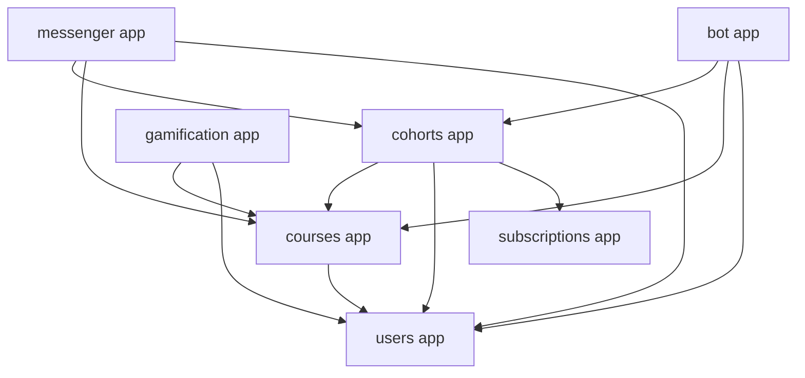
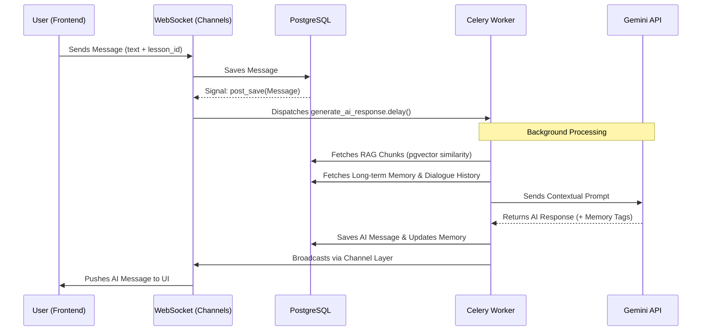

# AzureLMS Architecture Map

This document provides a high-level overview of the AzureLMS system architecture, its modules, data flows, and technical implementation details, with a focus on AI/RAG and Telegram Bot integrations.

## 1. System Overview

AzureLMS is a modern Learning Management System built with Django. It features real-time communication, AI-powered tutoring, and gamification elements.

**Technology Stack:**
- **Backend**: Django (Python)
- **Real-time**: Django Channels (WebSockets)
- **Background Tasks**: Celery & Redis
- **Database**: PostgreSQL with `pgvector` for AI search
- **AI Engine**: Google Gemini API (Flash/Pro models)
- **Bot**: Aiogram (Telegram Bot API)
- **Storage**: AWS S3 / DigitalOcean Spaces

---

## 2. Module Dependency Map

The following diagram illustrates the primary dependencies between the different Django applications.

---

## 3. Core Data Flows

### A. Enrollment & Access Flow
1. **Selection**: User chooses a `Plan` from `subscriptions`.
2. **Payment**: User submits a `PaymentReceipt` in `cohorts`.
3. **Verification**: Admin verifies the receipt, which activates the `Enrollment`.
4. **Access**: Active `Enrollment` grants access to a `Cohort`, which links to a `Course`.
5. **Real-time**: Signals trigger `messenger` to join the user to relevant `ChatRooms`.

### B. AI/RAG Messenger Flow
This is the most complex data flow, involving multiple asynchronous components.

### C. Telegram Attendance Flow
1. **Initiation**: Teacher sends `/start_lesson` in a Telegram Group.
2. **Session**: `bot` creates a `TelegramLessonSession` linked to a `Cohort`.
3. **Check-in**: Students click a button; `bot` verifies their identity via `telegram_id` and `Enrollment` status.
4. **Finalization**: Teacher sends `/close_lesson`.
5. **Persistence**: `bot` service calls `upsert_attendance_and_xp`, creating `Attendance` records and updating `CustomUser.total_xp`.

---

## 4. Technical Deep Dives

### AI / RAG Integration (`messenger` app)
- **RAG Implementation**: Content from `Lesson` is normalized and split into chunks (`LessonRAGChunk`). Chunks are embedded using `gemini-embedding-001`.
- **Vector Search**: Uses `pgvector` in PostgreSQL for efficient cosine similarity search. It falls back to a manual Python implementation if `pgvector` is unavailable.
- **Contextual Awareness**: The AI prompt includes:
    - User's long-term memory (learned facts).
    - Last 10 dialogue messages.
    - Current lesson content (if applicable).
    - Relevant retrieved chunks from the entire course.

### Telegram Bot Integration (`bot` app)
- **Account Binding**: Uses a signed "magic link" from the LMS dashboard. A token is generated using Django's `Signer` and passed as a `start` parameter to the bot.
- **Session Management**: Tracks attendance sessions in real-time within Telegram groups, mapping Telegram `chat_id` to LMS `Cohort`.

---

## 5. Scalability & Decoupling Analysis

### Current Strengths
- **Asynchronous Processing**: Heavy AI and notification tasks are offloaded to Celery.
- **Stateless WebSockets**: Django Channels with Redis backends allows scaling the number of concurrent connections.
- **Database Optimization**: `pgvector` indexes and specialized Django indexes on RAG chunks.

### Areas for Improvement

#### 1. Decoupling Logic (Service Layer)
- **Issue**: High coupling between `messenger`, `cohorts`, and `courses`. Signals in `messenger` directly import models from other apps.
- **Improvement**: Introduce a dedicated **Service Layer** or **Event Dispatcher**. Instead of direct imports, use a lightweight event system to notify other modules of changes (e.g., "StudentEnrolled" event).

#### 2. RAG Performance
- **Issue**: Reindexing large courses synchronously (even in Celery) can be slow.
- **Improvement**: Implement incremental indexing. Only re-embed chunks that have actually changed (using `chunk_hash` comparisons).

#### 3. Database Bottlenecks
- **Issue**: As the user base grows, the `Attendance` and `Message` tables will grow rapidly.
- **Improvement**:
    - **Partitioning**: Partition the `Message` table by `room_id` or `created_at`.
    - **Caching**: Aggressively cache `Enrollment` status and `User` profiles in Redis to avoid redundant DB hits during WebSocket/Bot interactions.

#### 4. Bot Responsiveness
- **Issue**: During mass attendance check-ins (e.g., 100 students clicking at once), the synchronous `register_checkin` logic might experience contention.
- **Improvement**: Use an atomic "Check-in Queue" in Redis. The bot acknowledges the click immediately, and a background worker processes the database writes.

---

*Document generated by AzureLMS AI Architecture Analysis Tool.*
